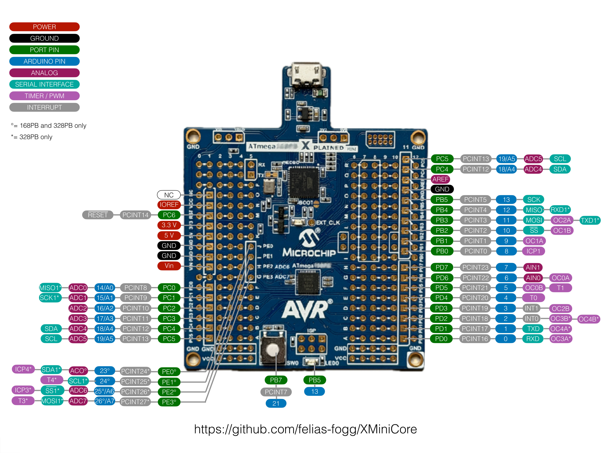

# XMiniCore

This is a debug-enabled Arduino core for the *ATmega Xplained Mini* series of Microchip development boards. These boards with an Arduino UNO R3 footprint contain in addition to an ATmega328 or ATmega168 MCU an embedded debugger and programmer. With [PyAvrOCD](https://pyavrocd.io), this makes them a plug-and-play solution for debugging using the Arduino IDE 2. In other words, this is the perfect solution for developing Arduino UNO R3 projects.

The core is a fork of [MCUdude's MiniCore](https://github.com/MCUdude/MiniCore), tailored to the pecularities of the Xplained Mini boards. It is meant to be a replacement for the [Atmel AVR Xplained-minis](https://github.com/AtmelUniversityFrance/atmel-avr-xmini-boardmanagermodule) board package.

# Table of contents

- [Supported boards](#supported-boards)
- [Supported clock frequencies](#supported-clock-frequencies)
- [Debug option](#debug-option)
- [EEPROM retain option](eeprom-retain-option)
- [Printf support](#printf-support)
- [Pin macros](#pin-macros)
- [Wiring reference](#wiring-reference)
- [Programmers](#programmers)
- **[How to install](#how-to-install)**
  - [Boards Manager Installation](#boards-manager-installation)
  - [Manual Installation](#manual-installation)
  - [Arduino CLI Installation](#arduino-cli-installation)
  - [PlatformIO](#platformio)
- **[Getting started with XMiniCore](#getting-started-with-xminicore)**
     - [Upload or debug](#upload-or-debug)
     - [Powering external circuitry](#powering-external-circuitry ) 
     - [More options](further-options)

- [Pinout diagram](#pinout-diagram)

## Supported boards

This core supports the three following boards:

- [ATmega168PB Xplained Mini](https://www.microchip.com/en-us/development-tool/atmega168pb-xmini),
- [ATmega328P Xplained Mini](https://www.microchip.com/en-us/development-tool/atmega328p-xmini),
- [ATmega328PB Xplained Mini](https://www.microchip.com/en-us/development-tool/atmega328pb-xmini).

  

  The documentation of theses boards can be accessed through the links provided above. A rough comparison sketch of the capabilities of the different boards is provided by the following table.

| Xplained Mini       | ATmega168PB    | ATmega328P     | ATmega328PB    |
| ------------------- | -------------- | -------------- | -------------- |
| Flash               | 16 kB          | 32 kB          | 32 kB          |
| SRAM                | 1 kB           | 2 kB           | 2 kB           |
| EEPROM              | 0.5 kB         | 1 kB           | 1 kB           |
| IO pins (excl. RST) | 24 (+1 button) | 20 (+1 button) | 24 (+1 button) |
| Analog pins         | 8              | 8              | 8              |
| PWM pins            | 6              | 6              | 9              |
| TWI                 | 1              | 1              | 2              |
| SPI                 | 1              | 1              | 2              |
| UART                | 1              | 1              | 2              |

## Supported clock frequencies

| Frequency | Comment                                                      |
| --------- | ------------------------------------------------------------ |
| 16 MHz    | Standard clock frequency                                     |
| 8 MHz     | This clock frequency is chosen automatically when the target supply voltage is reduced to 3.3 volts (see XPlained Mini documentation) |

So, if you have changed the supply voltage on the board, you need to change the clock frequency in the `Tools` menu. 

## Debug option

The default for these boards is to leave debugging mode when the debugging session is terminated (`leave at exit`). This enables you to upload code using the  `Upload` button instead of using the `Debug` button, which is in most cases faster. However, when you connect external circuitry with an external power supply, such a supply cannot be automatically disconnected when attempting to enter debugWIRE mode. In this case, the `stay at exit` should be chosen. Uploading the new code will then be done when starting the debugger, as it is described in the section on [powering external circuitry](#powering-the-board-and-external-circuitry ).

## EEPROM retain option

If you want the EEPROM to be erased every time you upload a new sketch, you can turn off this option. You have to select `Burn bootloader` to enable or disable EEPROM retain. Note that when uploading a sketch while debugging, the EEPROM is always retained.

## Printf support

Unlike the official Arduino cores, XMiniCore has printf support out of the box. If you're not familiar with printf, you should probably [read this first](https://www.tutorialspoint.com/c_standard_library/c_function_printf.htm). It's added to the Print class and will work with all libraries that inherit Print. Printf is a standard C function that lets you format text much easier than using Arduino's built-in print and println. Note that this implementation of printf will NOT print floats or doubles. This is disabled by default to save space, but can be enabled using a build flag if using PlatformIO.

If you're using a serial port, simply use `Serial.printf("Milliseconds since start: %ld\n", millis());`. You can also use the `F()` macro if you need to store the string in flash. Other libraries that inherit the Print class (and thus support printf) are the LiquidCrystal LCD library and the U8G2 graphical LCD library.

## Pin macros

Note that you don't have to use the digital pin numbers to refer to the pins. You can also use some predefined macros that map "Arduino pins" to the port and port number. This can result in code that's more portable across different chips and Arduino cores:

```
// Use PIN_PB5 macro to refer to pin PB5 (Arduino pin 13)
digitalWrite(PIN_PB5, HIGH);

// Results in the exact same compiled code
digitalWrite(13, HIGH);
```

## Wiring reference

To extend this core's functionality a bit further, MCUdude added a few missing Wiring functions. As many of you know, Arduino is based on Wiring, but that doesn't mean the Wiring development isn't active. These functions are used as "regular" Arduino functions, and there's no need to include an external library.

For further information, please view the [Wiring reference page](https://github.com/MCUdude/MiniCore/blob/master/Wiring_reference.md) of MiniCore.

## Programmers

The default programmer is `Xplained Mini`. It is used to change the `EEPROM retained` fuse and to upload sketches. This means, no bootloader is necessary. And in fact, bootloaders are not supported by this core.

The only alternative programmer is `Simulator (simavr)`. This programmer cannot be used to upload a sketch. However,  it will start a simulator when you request to debug the sketch.

## How to install

#### Boards Manager Installation

This installation method requires Arduino IDE version 1.8.0 or more recent.

- Open the Arduino IDE.

- Open the `File > Preferences` menu item.

- Enter the following URL in `Additional Boards Manager URLs`:

  ```
  https://felias-fogg.github.io/XMiniCore/package_felias-fogg_XMiniCore_index.json
  ```

- Open the `Tools > Board > Boards Manager...` menu item or click on the board symbol in the left icon column of the IDE 2 window.

- Wait for the platform indexes to finish downloading.

- Scroll down until you see the `XMiniCore` entry and click on it.

- Click `Install`.

- After installation is complete, close the `Boards Manager` window.

#### Manual Installation

Download the most recent release (right side on repo webpage). Extract the ZIP ar TAR.GZ file, and move the extracted folder to the location `~/Documents/Arduino/hardware/XMiniCore`. Create the `hardware` and the `XMiniCore` folder if they do not exist. Rename the extracted folder (probably something like `XMiniCore-x.y.z`) to `avr`. Open the Arduino IDE, and a new category in the boards menu called `XMiniCore (in Sketchbook)` will show up.

Note that a manual installation will not download binary tools such as the most recent avrdude program and the debugging tool. 

#### Arduino CLI Installation

Run the following command in a terminal:

```
arduino-cli core install XMiniCore:avr --additional-urls https://felias-fogg.github.io/XMiniCore/package_felias-fogg_XMiniCore_index.json
```

#### PlatformIO

[PlatformIO](http://platformio.org/) is an open-source ecosystem for IoT and embedded systems. The XPlained Mini boards are only indirectly supported by the generic ATmega chips through MiniCore. This may change in the future.

## Getting started with XMiniCore

#### Upload or debug

If you want to upload a sketch to the board or you want to debug it, proceed as follows:

- Connect the board with a USB cable to your desktop computer.
- Open the `Tools > Board` menu item, select `XMiniCore`, and select your target board.
- Open the sketch you want to upload or debug in the `Files` menu.
- If you want to debug the sketch, select `Optimize for Debugging` in the `Sketch` menu. This will lead to a bigger code footprint, but it will make the debugging experience much smoother.
- Click on the `Upload` button (rigth arrow top left of the IDE window). Now your code should be running on the board.
- If you want to debug the code, click afterward on the `Debug` button (bug in front of triangle right of the `Upload` button). This will verify that the code is loaded, start the debugger, and it will stop execution in the first line of the internal `main` function. Now, you can debug.
- Instead of clicking first on `Upload` and then on `Debug`, you can click on `Verify` (the checkmark symbol top left of the IDE window) in order to compile the code and then on `Debug`, which will upload the code and start the debugger. Uploading the code this way is much slower, however (roughly 3 times).

  More information on how to use the debugger can be found in the [PyAvrOCD manual](https://pyavrocd.io) in the [section on debugging](https://pyavrocd.io/debugging/).

#### Powering external circuitry  

If you are powering some connected circuitry, e.g., an Arduino shield, from the development board, then you should make sure to power it from the `IOREF` pin and not from the `5V` or `3.3V` pin. The reason for that is that `IOREF` is under the control of the on-board debugger, while the `5V` and `3.3V` pins are not controlled. When the on-board debugger power-cycles the target chip in order to enter debugWIRE mode, then `IOREF` will also be switched off and on again, while `5V` and `3.3V` always deliver power. In the latter case, it will make the automatic power-cycle feature useless. The same is true when such external circuits are powered externally. 

In the case where external power cannot be automatically disconnected, one has to proceed as follows in order to debug a sketch:

1. Select `Debug mode` = `stay at exit` in the `Tools` menu,

2. disconnect all external circuits,

3. start debugging by using the `Verify` and `Debug` buttons,
4. reconnect all circuits,
5. From now on use only the `Verify` and `Debug` buttons.

If you use the `Upload` button, debugWIRE mode will be terminated. In this case, you have to start at step 2 again.

If you want to leave debugWIRE mode and unprogram the DWEN fuse, type into the `Debug Console` the command `monitor debugwire disable` and leave the debugger afterward. 

#### More options

If you want to make use of more options, e.g., different BOD levels or other clock frequencies, you need to make use of [MiniCore](https://github.com/MCUdude/MiniCore). In addition, you may need to set a few fuses in the SUFFER register (see board documentation), which can be done using avrdude.

## Pinout diagram



